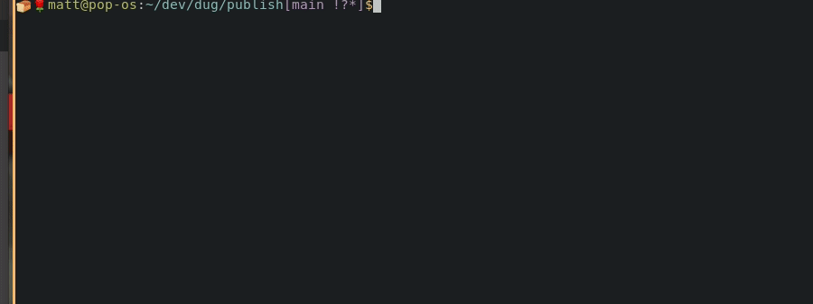
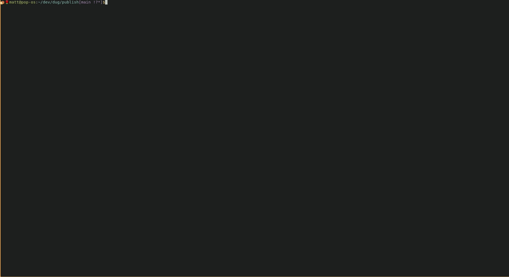

# dug

 (Unmaintained)

A powerful global DNS propagation checker that can output in a variety of formats.

The goal of dug is to make it easy to check the propagation of DNS records. It is also capable of providing templated output that can be used in scripts for things like monitoring.

For detailed documentation check out [dug.unfrl.com](https://dug.unfrl.com)

## Usage

The easiest way to explore dug is through the help.

- `dug help` -> Get top level help explaining the different verbs
- `dug help run` or `dug run --help` -> Get details about a specific verb (run, which is the default)
- `dug help update` or `dug update --help` -> Get details about the update verb

The simplest way to get started is to just run a query against the domain whose DNS records you're updating.
For example: `dug git.kaijucode.com`:

You can also do complicated things like ask for specific record types, use the most reliable server per continent, get the output as json, and pipe it into other applications: `dug git.kaijucode.com -q A --output-format JSON --server-count 1 --output-template Ipaddress,city,value,responsetime | jq`:

## Localization

dug automatically uses the current system's culture for localization. (You can override LANG on linux to test it).

Currently supports the following languages:

- (en) English
- (es) Spanish
- (de) German

## Installation

### Linux x86 and ARM

The linux builds are distributed as executables at the [latest release](https://git.unfrl.com/Unfrl/dug/releases/latest). There used to be package distributions (deb, rpm, etc) and they will be back, this work is being tracked [here](https://git.unfrl.com/Unfrl/dug/issues/2).

### Arch

A friend put dug in the AUR! [here](https://aur.archlinux.org/packages/dug-git/)

### Docker

Not sure if this counts as an "Installation" but there is a docker image available [here](https://hub.docker.com/r/unfrl/dug)

### Homebrew (Mac & Linux)

Install from homebrew with `brew install dug`

### OSX
> Homebrew is the easiest method for OSX but there is also a binary available

1. Go to the [latest release](https://git.unfrl.com/Unfrl/dug/releases/latest) and download the osx binary.
   - It should look like `dug-osx-x64`
2. You should be able to download that, make is executable, and run it from the terminal. Then you can put it somewhere and update your path so you can execute it from anywhere.

### Windows

#### Executable

1. Go to the [latest release](https://git.unfrl.com/Unfrl/dug/releases/latest) and download the .exe binary.
   - It should look like `dug.exe`
2. You should be able to download that and run it from the terminal. Then you can put it somewhere and update your path so you can execute it from anywhere.

## Development

This is a .net 6 project, so as long as you have the dotnet cli, available [here](https://dotnet.microsoft.com/download/dotnet/6.0) you should be able to do the following: `dotnet build ./cli`

The project was developed in VSCode so the debugger profiles that I have used are available if you're also using VSCode.

The commands to build an optimized executable vary depending on the platform but are all available in the [workflows directory](.forgejo/workflows). Here is the one to build the linux-x64 executable as an example:

`dotnet publish -r linux-x64 -c Release -p:PublishSingleFile=true -p:PublishReadyToRun=true --self-contained true -o publish ./cli`

### Testing

There is currently fairly limited testing, what does exist uses the [BATS](https://github.com/sstephenson/bats) tool.

To run the BATS tests you will need to have cloned dug recursively, like: `git clone --recursive <dug_repo_url>`

If you didnt do that you can run this to restore the BATS submodules into ./cli.tests/bats/libs: `git submodule update --init --recursive`

Once you have BATS you should be able to simply run the BATS tests with: `./cli.tests/bats/run.sh`

Made with ❤️ by [Unfrl](https://unfrl.com)
