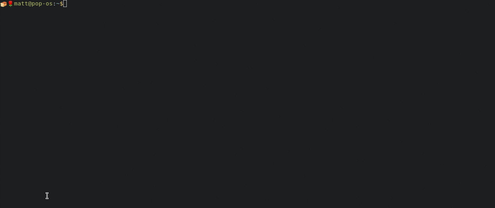
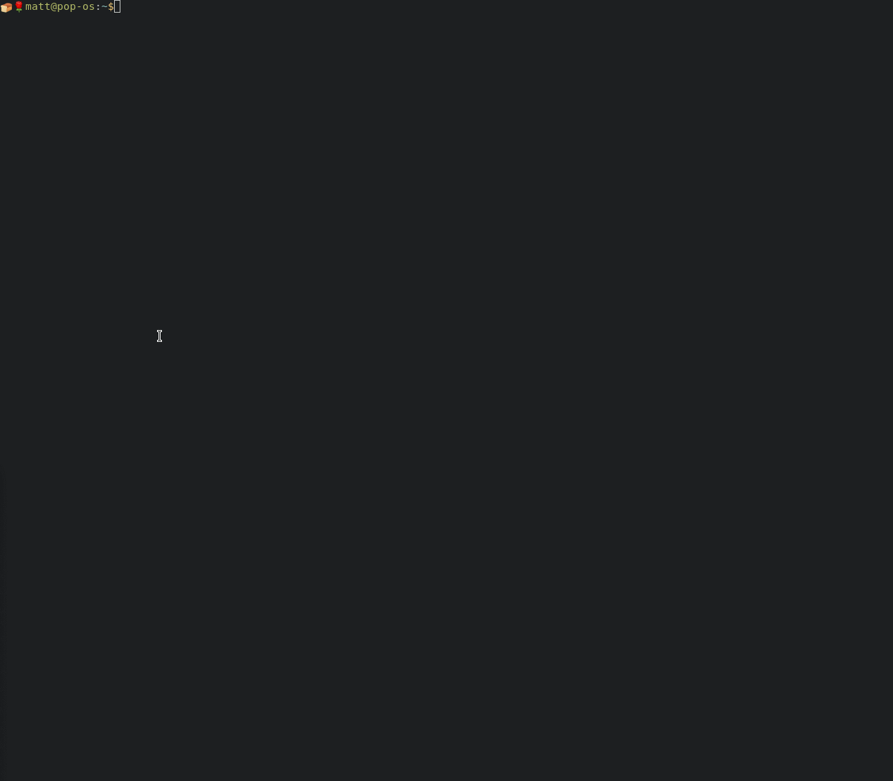

# dug

A powerful global DNS progagation checker that can output in a variety of formats.

The goal of dug is to make it easy to check the propagation of DNS records. It is also capable of providing templated output that can be used in scripts for things like monitoring.

For detailed documentation check out [dug.unfrl.com](https://dug.unfrl.com)

## Usage
The easiest way to explore dug is through the help.
* `dug help` -> Get top level help explaining the different verbs
* `dug help run` or `dug run --help` -> Get details about a specific verb (run, which is the default)
* `dug help update` or `dug update --help` -> Get details about the update verb

The simplest way to get started is to just run a query against the domain whose DNS records you're updating.
For example: `dug git.kaijucode.com`:

You can also do complicated things like ask for specific record types, use the most reliable server per continent, get the output as json, and pipe it into other applications: `dug git.kaijucode.com -q A --output-format JSON --server-count 1 --output-template Ipaddress,city,value,responsetime | jq`:

## Localization
dug automatically uses the current system's culture for localization. (You can override LANG on linux to test it).

Currently supports the following languages:
- (en) English
- (es) Spanish
- (de) German

## Installation

### Linux Deb (Debian, Ubuntu, Mint, Pop!_os)

1. Go to the [latest release](https://github.com/unfrl/dug/releases/latest) and download the .deb package.
    * It should look like `dug.<version>.linux-x64.deb`
2. On most distros double clicking the .deb package will allow you to install via a UI, alternatively it can be installed by running `sudo dpkg -i ./dug.<version>.linux-x64.deb`

### Linux RPM (RHEL, CentOS, Fedora)

1. Go to the [latest release](https://github.com/unfrl/dug/releases/latest) and download the .rpm package.
    * It should look like `dug.<version>.linux-x64.rpm`
2. On most distros double clicking the .deb package will allow you to install via a UI, alternatively it can be installed by running `rpm -i ./dug.<version>.linux-x64.deb`

### Arch

A friend put dug in the AUR! [here](https://aur.archlinux.org/packages/dug-git/)

### Snap

> Install snap if you dont have it [Guide](https://snapcraft.io/docs/getting-started#heading--install)

1. Run: `sudo snap install unfrl-dug`
2. Invoke with: `unfrl-dug [OPTIONS]`

Note: Annoyingly `dug` is a reserved package name and I am waiting for them to give it to me. When I get it the package will just be named `dug`

### Docker

Not sure if this counts as an "Installation" but there is a docker image available [here](https://hub.docker.com/r/unfrl/dug)

### OSX
> Not Officially Supported Yet
1. Go to the [latest release](https://github.com/unfrl/dug/releases/latest) and download the osx binary.
    * It should look like `dug-osx-x64`
2. You should be able to download that, make is executable, and run it from the terminal. Then you can put it somewhere and update your path so you can execute it from anywhere.

### Windows

#### Chocolatey (choco cli)
> Chocolatey manually reviews all packages, which takes a while, so this can lag behind the latest. [status info here](https://chocolatey.org/packages/dug)
1. Run: `choco install dug`

#### Executable
1. Go to the [latest release](https://github.com/unfrl/dug/releases/latest) and download the .exe binary.
    * It should look like `dug.exe`
2. You should be able to download that and run it from the terminal. Then you can put it somewhere and update your path so you can execute it from anywhere.

## Development

This is a .net 5 project, so as long as you have the dotnet cli, available [here](https://dotnet.microsoft.com/download/dotnet/5.0) you should be able to do the following: `dotnet build ./cli`

The project was developed in VSCode so the debugger profiles that I have used are available if you're also using VSCode.

### Testing

There is currently fairly limited testing, what does exist uses the [BATS](https://github.com/sstephenson/bats) tool.

To run the BATS tests you will need to have cloned dug recursively, like: `git clone --recursive <dug_repo_url>`

If you didnt do that you can run this to restore the BATS submodules into ./cli.tests/bats/libs: `git submodule update --init --recursive`

Once you have BATS you should be able to simply run the BATS tests with: `./cli.tests/bats/run.sh`

## License
The license used by dug, [here](./cli/LICENSE), is very explicitly designed to try to keep capitalists from benefiting from this tool. This is not a traditional license but it is very simple, please read it.

Made with ❤️ by [Unfrl](https://unfrl.com)
