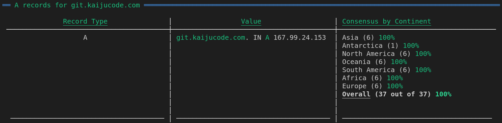

dug is designed to be usable by humans (the default output is pretty tables) as well as automation scripts via templated output to CSV or JSON. The easiest way to get started is to [install it](./install) and run `dug help`.

## Verbs

dug is designed using 'verbs', much like git. There are technically 4 verbs (`run`,`update`,`help`, and `version`) but the first 2 are the interesting ones. The verbs are gone over in more detail under the Usage section.

### `run`:
> Usage details [here](./run)

The `run` verb allows parallel queries to be executed against DNS Servers and for the results to be provided in 3 ways:
1. Tables, which are the default and are intended to give the user a quick idea of the results and how they vary by continent.
2. JSON or CSV, which are intended for use in an automation context and can be templated.

The simplest use of `run`, with all defaults, gets the A records for the specified domain from the top 6 servers available from each continent (ranked by reliability). This looks like `dug run git.kaijucode.com` or `dug git.kaijucode.com` (because `run` is the default verb). It returns something like this:

### `update`:
> Usage details [here](./update)

The `update` verb is used to manipulate the server list dug maintains in `~/.dug/servers.csv`.

By default the `update` verb pulls in new DNS servers from https://public-dns.info/nameservers.csv. This list is decent but `update` also provides a number of ways for users to provide their own servers, from local and remote sources.

The simplest use of `update`, with all defaults, simply gets all of the servers from https://public-dns.info/nameservers.csv and adds any novel ones to its internal server list. This looks like `dug run update`.

## Templated Input
> Usage details [here](./templated_input)

While dug does ship with a bunch of DNS servers in `~/.dug/servers.csv`, and these are used by default, users can also specify servers from local and remote sources as long as they provide the structure of the data.

The relevant options for templating input are `--data-columns`, `--data-headers-present`, and `--data-separator` and are present on both `run` and `update`. While their application on each verb is slightly different, i.e. on `update` they apply to servers provided via a file (-f) or a remote url (--update-url) whereas `run` doesnt have a remote url source specifier, their goal is the same: to tell dug the structure of the server data being provided to it.

## Templated Output
> Usage details [here](./templated_output)

By default dug is setup to quickly give a user an idea of the state of DNS records for a domain globally. While this is its core functionality, it is also capable of providing output in a templated manner that can be used by scripts, applications, or just piping the output around.

The relevant options for templating output are `--output-template` and `--output-format` and are present on the `run` verb.